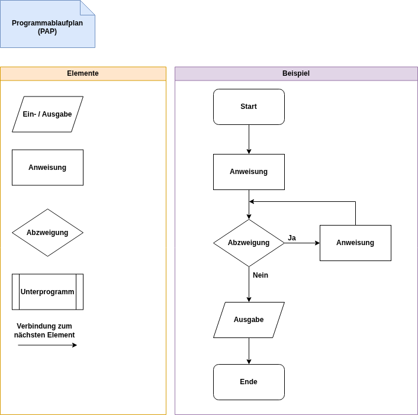
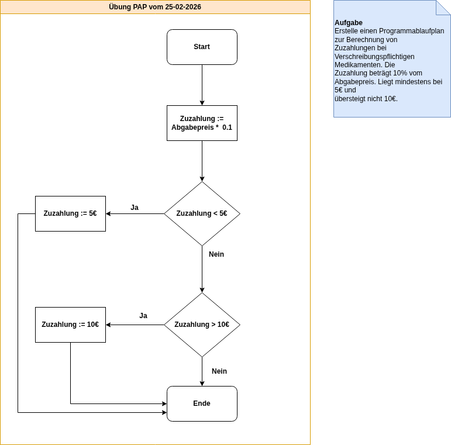
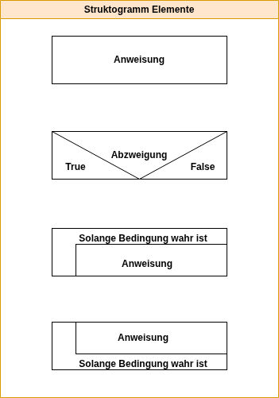
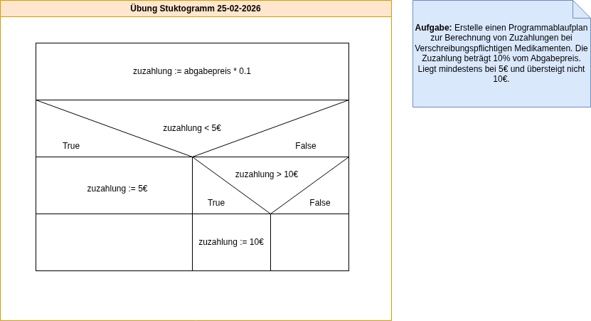

# TQ6 - FIAE - Roehle

## Inhalt

1. [Phasen der Softwareentwickelung](#phasen)
    1. [Anforderungsanalyse](#analyse)
        1. [Lastenheft](#lastenheft)
        2. [Pflichtenheft](#pflichtenheft)
    2. [Design](#design)
        1. [Programmablaufplan](#pap)
        2. [Struktogramm](#strukto)
        3. [Pseudocode](#pseudo)
    3. Umsetzung
    4. Testen
    5. Dokumentation
    6. Auslieferung
    7. Wartung und Support

## Phasen der Softwareentwickelung {#phasen}

In diesem Abschnitt werden die Phasen der Softwareentwickelung beschrieben.

### Anforderungsanalyse {#analyse}

Bei der Anforderungsanalyse werden die Anforderungen bestimmt. Dazu müssen die konkreten Vorstellungen des Auftraggebers erfasst werden. Eine Analyse des Ist-Zustandes (Geschäftsprozesse, vorhandene Daten) muss erfolgen und eine Aufwandsabschätzung gemacht werden. Wichtige Instrumente in diesem Schritt sind das Lasten- und Pflichtenheft.

#### Lastenheft (Was und Wofür) {#lastenheft}

Das Lastenheft wird vom Auftraggeber erstellt und enthält alle Anforderungen an die Software.

#### Pflichtenheft (Wie und Womit) {#pflichtenheft}

Das Pflichtenheft wird vom Auftraggeber entwickelt. Es beantwortet die Fragen wie und womit die im Lastenheft gestellten Anforderungen realisiert werden.

### Design {#design}

#### Programmablaufplan {#pap}

Ein Programmablaufplan ist eine grafische Darstellung zur Umsetzung eines Algorithmus. Die Symbole sind nach DIN 66001 genormt.

##### Übersicht



##### Übung vom 25-02-2026

> **Aufgabe:**
>
> Erstelle einen Programmablaufplan zur Berechnung von Zuzahlungen bei Verschreibungspflichtigen Medikamenten. Die Zuzahlung beträgt 10% vom Abgabepreis. Liegt mindestens bei 5€ und übersteigt nicht 10€.



#### Struktogramm {#strukto}

Das Struktogramm ist ein Diagrammtyp zur Darstellung von Programmentwürfen. Es wird auch als Nassi-Shneiderman-Diagram bezeichnet.



##### Übung vom 25-02-2026

> **Aufgabe:**
>
> Erstelle ein Struktogramm zur Berechnung von Zuzahlungen bei Verschreibungspflichtigen Medikamenten. Die Zuzahlung beträgt 10% vom Abgabepreis. Liegt mindestens bei 5€ und übersteigt nicht 10€.



#### Pseudocode {#pseudo}

Pseudocode dient zur Veranschaulichung eines Algorithmus. Er ähnelt höheren Programmiersprachen gemischt mit natürlicher Sprache.

##### Übung vom 25-02-2026

> **Aufgabe:**
>
> Es soll die Summe aller ganzen Zahlen, welche durch 3 teilbar sind berechnet und ausgegen werden.

```
zähler := 1
summe := 0
Wiederhole solange zähler <= 100
    Wenn zähler % 3 = 0 dann
        summe = summe + zähler
    Ende Verzweigung
    zähler = zähler + 1
Ende Schleife
Ausgabe: summe
```
